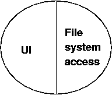

## Simple Example

This example deals with a directory browsing protocol - basically a stripped down version of FTP, but without even the file transfer part. We only consider listing a directory name, listing the contents of a directory and changing the current directory - all on the server side, of course. This is a complete worked example of creating all components of a client-server application. It is a simple program which includes messages in both directions, as well as design of messaging protocol.

Look at a simple non-client-server program that allows you to list files in a directory and change and print the directory on the server. We omit copying files, as that adds to the length of the program without really introducing important concepts. For simplicity, all filenames will be assumed to be in 7-bit ASCII. If we just looked at a standalone application first, then the pseudo-code would be

```
read line from user
while not eof do
  if line == dir
    list directory
  else

  if line == cd <dir>
    change directory
  else

  if line == pwd
    print directory
  else

  if line == quit
    quit
  else
    complain

  read line from user
```

A non-distributed application would just link the UI and file access code 



In a client-server situation, the client would be at the user end, talking to a server somewhere else. Aspects of this program belong solely at the presentation end, such as getting the commands from the user. Some are messages from the client to the server, some are solely at the server end. 


 For a simple directory browser, assume that all directories and files are at the server end, and we are only transferring file information from the server to the client. The client side (including presentation aspects) will become

```
read line from user
while not eof do
  if line == dir
    *list directory*
  else

  if line == cd <dir>
    *change directory*
  else

  if line == pwd
    *print directory*
  else

  if line == quit
    quit
  else
    complain

  read line from user
```

where the stared lines involve communication with the server.

### Alternative presentation aspects

A GUI program would allow directory contents to be displayed as lists, for files to be selected and actions such as change directory to be be performed on them. The client would be controlled by actions associated with various events that take place in graphical objects. The pseudo-code might look like

```
change dir button:
  if there is a selected file
    *change directory*
  if successful
    update directory label
    *list directory*
    update directory list
```    

The functions called from the different UI's should be the same - changing the presentation should not change the networking code 

### Protocol - informal

client request 	| server response
               -|-
`dir` 	        | send list of files
`cd <dir>` 	    | change dir<br> send error if failed<br> send ok if succeed
`pwd` 	        | send current directory
`quit` 	        | quit 


### Text protocol

This is a simple protocol. The most complicated data structure that we need to send is an array of strings for a directory listing. In this case we don't need the heavy duty serialisation techniques of the last chapter. In this case we can use a simple text format.

But even if we make the protocol simple, we still have to specify it in detail. We choose the following message format:

* All messages are in 7-bit US-ASCII
* The messages are case-sensitive
* Each message consists of a sequence of lines
* The first word on the first line of each message describes the message type. All other words are message data
* All words are separated by exactly one space character
* Each line is terminated by CR-LF

Some of the choices made above are weaker in real-life protocols. For example

* Message types could be case-insensitive. This just requires mapping message type strings down to lower-case before decoding
* An arbitrary amount of white space could be left between words. This just adds a little more complication, compressing white space
* Continuation characters such as `"\"` can be used to break long lines over several lines. This starts to make processing more complex
* Just a `"\n"` could be used as line terminator, as well as `"\r\n"`. This makes recognising end of line a bit harder

All of these variations exist in real protocols. Cumulatively, they make the string processing just more complex than in our case. 

client request 	      |server response
                     -|-
send `"DIR"` 	      |send list of files, one per line terminated by a blank line
send `"CD <dir>"`     |change dir<br> send "ERROR" if failed<br> send "OK"
send `"PWD"` 	      |send current working directory

### Server code

```go

/* FTP Server
 */
package main

import (
	"fmt"
	"net"
	"os"
)

const (
	DIR = "DIR"
	CD  = "CD"
	PWD = "PWD"
)

func main() {

	service := "0.0.0.0:1202"
	tcpAddr, err := net.ResolveTCPAddr("tcp", service)
	checkError(err)

	listener, err := net.ListenTCP("tcp", tcpAddr)
	checkError(err)

	for {
		conn, err := listener.Accept()
		if err != nil {
			continue
		}
		go handleClient(conn)
	}
}

func handleClient(conn net.Conn) {
	defer conn.Close()

	var buf [512]byte
	for {
		n, err := conn.Read(buf[0:])
		if err != nil {
			conn.Close()
			return
		}

		s := string(buf[0:n])
		// decode request
		if s[0:2] == CD {
			chdir(conn, s[3:])
		} else if s[0:3] == DIR {
			dirList(conn)
		} else if s[0:3] == PWD {
			pwd(conn)
		}

	}
}

func chdir(conn net.Conn, s string) {
	if os.Chdir(s) == nil {
		conn.Write([]byte("OK"))
	} else {
		conn.Write([]byte("ERROR"))
	}
}

func pwd(conn net.Conn) {
	s, err := os.Getwd()
	if err != nil {
		conn.Write([]byte(""))
		return
	}
	conn.Write([]byte(s))
}

func dirList(conn net.Conn) {
	defer conn.Write([]byte("\r\n"))

	dir, err := os.Open(".")
	if err != nil {
		return
	}

	names, err := dir.Readdirnames(-1)
	if err != nil {
		return
	}
	for _, nm := range names {
		conn.Write([]byte(nm + "\r\n"))
	}
}

func checkError(err error) {
	if err != nil {
		fmt.Println("Fatal error ", err.Error())
		os.Exit(1)
	}
}
```

### Client code 

```go
/* FTPClient
 */
package main

import (
	"fmt"
	"net"
	"os"
	"bufio"
	"strings"
	"bytes"
)

// strings used by the user interface
const (
	uiDir  = "dir"
	uiCd   = "cd"
	uiPwd  = "pwd"
	uiQuit = "quit"
)

// strings used across the network
const (
	DIR = "DIR"
	CD  = "CD"
	PWD = "PWD"
)

func main() {
	if len(os.Args) != 2 {
		fmt.Println("Usage: ", os.Args[0], "host")
		os.Exit(1)
	}

	host := os.Args[1]

	conn, err := net.Dial("tcp", host+":1202")
	checkError(err)

	reader := bufio.NewReader(os.Stdin)
	for {
		line, err := reader.ReadString('\n')
		// lose trailing whitespace
		line = strings.TrimRight(line, " \t\r\n")
		if err != nil {
			break
		}

		// split into command + arg
		strs := strings.SplitN(line, " ", 2)
		// decode user request
		switch strs[0] {
		case uiDir:
			dirRequest(conn)
		case uiCd:
			if len(strs) != 2 {
				fmt.Println("cd <dir>")
				continue
			}
			fmt.Println("CD \"", strs[1], "\"")
			cdRequest(conn, strs[1])
		case uiPwd:
			pwdRequest(conn)
		case uiQuit:
			conn.Close()
			os.Exit(0)
		default:
			fmt.Println("Unknown command")
		}
	}
}

func dirRequest(conn net.Conn) {
	conn.Write([]byte(DIR + " "))

	var buf [512]byte
	result := bytes.NewBuffer(nil)
	for {
		// read till we hit a blank line
		n, _ := conn.Read(buf[0:])
		result.Write(buf[0:n])
		length := result.Len()
		contents := result.Bytes()
		if string(contents[length-4:]) == "\r\n\r\n" {
			fmt.Println(string(contents[0 : length-4]))
			return
		}
	}
}

func cdRequest(conn net.Conn, dir string) {
	conn.Write([]byte(CD + " " + dir))
	var response [512]byte
	n, _ := conn.Read(response[0:])
	s := string(response[0:n])
	if s != "OK" {
		fmt.Println("Failed to change dir")
	}
}

func pwdRequest(conn net.Conn) {
	conn.Write([]byte(PWD))
	var response [512]byte
	n, _ := conn.Read(response[0:])
	s := string(response[0:n])
	fmt.Println("Current dir \"" + s + "\"")
}

func checkError(err error) {
	if err != nil {
		fmt.Println("Fatal error ", err.Error())
		os.Exit(1)
	}
}
```