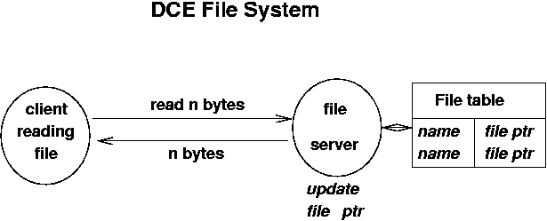
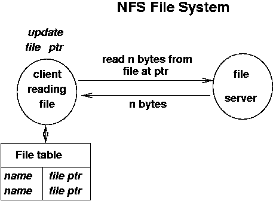
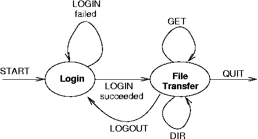

## State

 Applications often make use of state information to simplify what is going on. For example

* Keeping file pointers to current file location
* Keeping current mouse position
* Keeping current customer value

In a distributed system, such state information may be kept in the client, in the server, or in both.

The important point is to whether one process is keeping state information about itself or about the other process. One process may keep as much state information about itself as it wants, without causing any problems. If it needs to keep information about the state of the other process, then problems arise: the process' actual knowledge of the state of the other may become incorrect. This can be caused by loss of messages (in UDP), by failure to update, or by s/w errors.

An example is reading a file. In single process applications the file handling code runs as part of the application. It maintains a table of open files and the location in each of them. Each time a read or write is done this file location is updated. In the DCE file system, the file server keeps track of a client's open files, and where the client's file pointer is. If a message could get lost (but DCE uses TCP) these could get out of synch. If the client crashes, the server must eventually timeout on the client's file tables and remove them. 



In NFS, the server does not maintain this state. The client does. Each file access from the client that reaches the server must open the file at the appropriate point, as given by the client, to perform the action.



 If the server maintains information about the client, then it must be able to recover if the client crashes. If information is not saved, then on each transaction the client must transfer sufficient information for the server to function.

If the connection is unreliable, then additional handling must be in place to ensure that the two do not get out of synch. The classic example is of bank account transactions where the messages get lost. A transaction server may need to be part of the client-server system.

### Application State Transition Diagram

A state transition diagram keeps track of the current state of an application and the changes that move it to new states.

Example: file transfer with login: 



This can also be expressed as a table 

Current state 	|Transition 	|Next state
      -         |       -       |    -
login 	        |login failed   |login
                |login succeeded|file transfer
file transfer   |dir 	        |file transfer
                |get            |file transfer
                |logout         |login
                |quit           |- 
                

### Client state transition diagrams                 

The client state diagram must follow the application diagram. It has more detail though: it *writes* and then *reads*

Current state  |Write 	    |Read               |Next state
   -    |        -          |         -         |       -
login 	|LOGIN name password|FAILED             |login
        |                   |SUCCEEDED 	        |file transfer
file transfer| 	CD dir      |SUCCEEDED 	        |file transfer
        |                   |FAILED             |file transfer
        |GET filename 	    |#lines + contents  |file transfer
        |                   |ERROR              |file transfer
        |DIR                |#files + filenames |file transfer
        |                   |ERROR              |file transfer
        |quit               |none               |quit
logout  |none               |login 


### Server state transition diagrams

The server state diagram must also follow the application diagram. It also has more detail: it *reads* and then *writes*

Current state  |Write 	    |Read               |Next state
   -    |        -          |         -         |       -
login 	|LOGIN name password|FAILED             |login
        |                   |SUCCEEDED 	        |file transfer
file transfer| 	CD dir      |SUCCEEDED 	        |file transfer
        |                   |FAILED             |file transfer
        |GET filename 	    |#lines + contents  |file transfer
        |                   |ERROR              |file transfer
        |DIR                |#files + filenames |file transfer
        |                   |ERROR              |file transfer
        |quit               |none               |quit
logout  |none               |login 

### Server pseudocode

```
state = login
while true
    read line
    switch (state)
        case login:
            get NAME from line
            get PASSWORD from line
            if NAME and PASSWORD verified
                write SUCCEEDED
                state = file_transfer
            else
                write FAILED
                state = login
        case file_transfer:
            if line.startsWith CD
                get DIR from line
                if chdir DIR okay
                    write SUCCEEDED
                    state = file_transfer
                else
                    write FAILED
                    state = file_transfer
            ...
```

We don't give the actual code for this server or client since it is pretty straightforward. 

## Conclusion

Building any application requires design decisions before you start writing code. For distributed applications you have a wider range of decisions to make compared to standalone systems. This chapter has considered some of those aspects and demonstrated what the resultant code might look like. 