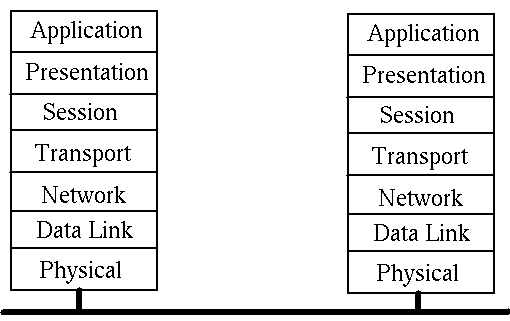
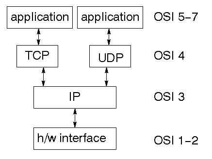

## Protocol Layers

Distributed systems are hard. There are multiple computers involved, which have to be connected in some way. Programs have to be written to run on each computer in the system and they all have to co-operate to get a distributed task done.

The common way to deal with complexity is to break it down into smaller and simpler parts. These parts have their own structure, but they also have defined means of communicating with other related parts. In distributed systems, the parts are called protocol layers and they have clearly defined functions. They form a stack, with each layer communicating with the layer above and the layer below. The communication between layers is defined by protocols.

Network communications requires protocols to cover high-level application communication all the way down to wire communication and the complexity handled by encapsulation in protocol layers.

### ISO OSI Protocol

Although it was never properly implemented, the OSI (Open Systems Interconnect) protocol has been a major influence in ways of talking about and influencing distributed systems design. It is commonly given in the following figure: 

OSI layers

The function of each layer is:

* Network layer provides switching and routing technologies

* Transport layer provides transparent transfer of data between end systems and is responsible for end-to-end error recovery and flow control

* Session layer establishes, manages and terminates connections between applications.

* Presentation layer provides independence from differences in data representation (e.g. encryption)

* Application layer supports application and end-user processes

### TCP/IP Protocol

While the OSI model was being argued, debated, partly implemented and fought over, the DARPA internet research project was busy building the TCP/IP protocols. These have been immensely successful and have led to The Internet (with capitals). This is a much simpler stack:

### Some Alternative Protocols

Although it almost seems like it, the TCP/IP protocols are not the only ones in existence and in the long run may not even be the most successful. There are many protocols occupying significant niches, such as

* Firewire
* USB
* Bluetooth
* WiFi

There is active work continuing on many other protocols, even quite bizarre ones such as those for the "internet in space."

The focus in this book will be on the TCP/IP, but you should be aware of these other ones. 
